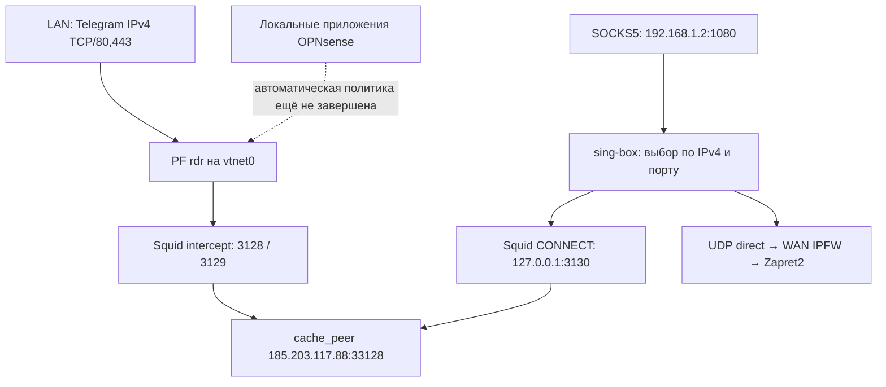

# Telegram: laboratory TCP/proxy policy and recovery runbook

**Status:** EXPERIMENTAL LAB CONFIGURATION · NOT AN APPROVED TCP/PROXY PLUGIN CONTRACT
**Updated:** 2026-10-01
**Superseded product boundary:** The owner's later October 1 instruction limits current product work to **Telegram Voice UDP** and three sequential stages: repeatable `MEDIA_PASS` through OPNsense, remote real-client `CALL_PASS`, then native plugin integration of the proven UDP behavior. See [product requirements](../REQUIREMENTS.md), [current handoff](../START_HERE.md), [roadmap](../ROADMAP.md) and [UDP oracle](TELEGRAM_VOICE_EMULATION_LAB.md).

This document is the **laboratory** record and recovery procedure for the already working Squid/sing-box/PF, external proxy and selected test routes. Preserve the proven October 1 TCP configuration unchanged. GUI-managed OPNsense persistence of the *separate lab settings* is acceptable for convenience, but Telegram TCP/TLS interception, Squid, sing-box, SOCKS integration, PF proxy redirects, parent proxy management and automatic proxy for the router console **are not current plugin deliverables**. The external proxy remains a laboratory prerequisite for real Telegram TCP signaling where needed; choosing the eventual product TCP architecture and an end-to-end clean-install TCP solution are **not approved work stages**.

Values `192.168.1.2`, `192.168.1.100`, `185.203.117.88:33128`, port assignments and TNAS host routes below are **testbed-specific**, not plugin defaults or automatic product policy. Historical measurements and run commands are retained to reproduce previous tests; they do not authorize packaging that configuration. The present `telegram_voice` marker under `/var/run` is deliberately temporary PoC state. After proving `MEDIA_PASS` and `CALL_PASS`, stage 3 will replace that transient product-state mechanism with native persisted plugin GUI/configuration and managed UDP lifecycle; no ad-hoc `rc.syshook` file should be installed for the final product.

**Laboratory success already measured:** LAN and SOCKS5 Telegram IPv4 TCP/80,443 traversed Squid and the external parent. The owner repeated transparent TNAS HTTPS on October 1 after correcting the HTTPS test route: HTTP 200 and Squid `FIRSTUP_PARENT`. These tests do **not** establish Telegram UDP media success. The active-helper October 1 UDP control intercepted 60 non-STUN Reflector Hellos and still produced no replies or established call. The historical September 22 owner-reported call through OPNsense remains uncorrelated with an exact winning strategy.

## Retained testbed goal (historical; no longer product scope)

The previously selected three-origin LAN/router-local/SOCKS separation with TCP/TLS routed through this parent proxy remains the experimental **testbed arrangement**, not the active `os-zapret2-restyle` development target. The earlier automatic no-proxy router-console requirement is explicitly cancelled. A console using an explicitly configured proxy is a valid test tool; it does not imply any product requirement to auto-proxy other local processes.

## Топология и ограничения

| Узел / назначение | Текущее значение |
|---|---|
| OPNsense | `26.7.3_8`, LAN `vtnet0`, адрес `192.168.1.2/24` |
| WAN OPNsense | `vtnet1`, `192.168.80.251/24`, MTU 1500 |
| Следующий шлюз | `192.168.80.1`; чужой роутер, доступа к нему нет |
| TNAS | TOS 7, `192.168.1.100`, интерфейс `ovs_eth1` |
| Контейнер | `tgvoice-lab`, `network=host`, последний проверенный статус `running` |
| UDP-цель лаборатории | `91.108.13.10:596`, один фиксированный reflector |
| TCP/TLS-цель проверки | `telegram.org`, закреплённый IPv4 `149.154.167.99` |
| Конечный TCP-прокси | `185.203.117.88:33128` |

`192.168.1.140` больше не является рабочим выходом Telegram. Альтернативного рабочего выхода сейчас нет; нельзя возвращать его в план как контроль или адрес восстановления. Доступ к чужому `192.168.80.1` также не является условием продолжения работы. При отсутствии ответов причина потери за локальным WAN остаётся неизвестной.

## Что уже работает и что ещё не доказано

| Источник | Текущий TCP/TLS | Текущий Telegram UDP | Состояние проверки |
|---|---|---|---|
| LAN / TNAS без прокси в приложении | PF `rdr` → Squid `3128/3129` → parent | WAN IPFW → divert `989` → dvtws2 | HTTPS прошёл 30 сентября; UDP перехвачен 1 октября, звонок не установлен |
| SOCKS5 `192.168.1.2:1080` | sing-box выбирает Telegram IPv4 TCP/80,443 → Squid `127.0.0.1:3130` → parent | `direct` → обычный IP-выход → применимые WAN IPFW-правила | HTTP/HTTPS и выбор parent прошли 1 октября; SOCKS UDP ASSOCIATE отдельным захватом ещё не проверен |
| Собственная командная строка OPNsense | С явным SOCKS/HTTP-прокси HTTPS проверен; автоматический отбор локального TCP/TLS не реализован/не подтверждён | Применим тот же выходной IPFW-селектор; отдельной проверки локального UDP нет | Локальный запрос без прокси не попадает в LAN `rdr`; единая автоматическая политика остаётся задачей |

`direct` у sing-box означает прямой исходящий сокет роутера, а не обход его выходного firewall. Попадание конкретного UDP в Zapret2 всё равно требует совпадения адреса назначения, IPv4, WAN-интерфейса и остальных условий IPFW. HTTP parent не переносит UDP.

Текущая TCP-политика ограничена IPv4 и портами 80/443. Telegram TCP на иных портах, raw MTProto на 443 и IPv6 этими HTTPS-проверками не квалифицированы. Это ограничения текущего результата, а не сокращение поставленной владельцем цели. Трафик P2P к произвольному адресу вне Telegram IPSET также не покрывается Telegram-таблицей.

## Squid и PF: применённая схема



Пунктир обозначает незавершённую задачу, не существующее правило. Явное использование SOCKS из консоли идёт через узел SOCKS5 этой схемы.

Существующие правила `pfctl -sn`:

| Вход | Назначение | Протокол/порт | Перенаправление |
|---|---|---|---|
| `vtnet0` | `<Telegram>` или `<Telegram_IPs>` | IPv4 TCP/80 | `127.0.0.1:3128` |
| `vtnet0` | те же таблицы | IPv4 TCP/443 | `127.0.0.1:3129` |
| `tun_singbox` | те же таблицы | IPv4 TCP/80,443 | соответственно `3128/3129`; правила сохранены из прежней схемы |

Правила `no rdr` для адреса самого LAN-интерфейса на SSH/HTTP/HTTPS стоят раньше. NAT LAN через `vtnet1` переводит исходный адрес в `192.168.80.251`, обычно с диапазоном исходных портов 1024–65535. Текущий sing-box имеет SOCKS inbound, а не TUN: наличие старых правил `tun_singbox` не доказывает использование этого интерфейса.

В `/usr/local/etc/squid/squid.conf` сохранены intercept-слушатели `127.0.0.1:3128`, `127.0.0.1:3129`, соответствующие `::1`, явный прокси `192.168.1.2:3128`, а также `ssl_bump peek bump_step1 all`, затем `ssl_bump splice all`. В имеющемся файле `pre-auth/*.conf` подключается до запрета `CONNECT !SSL_ports`. Прямой TCP/TLS без HTTP/SOCKS-протокола нельзя просто перенаправить на SOCKS-порт 1080 или явный CONNECT-порт 3130.

`/usr/local/etc/squid/pre-auth/parentproxy.conf`:

```squidconf
cache_peer 185.203.117.88 parent 33128 0 no-query default
cache_peer_access 185.203.117.88 allow all
never_direct allow all
```

Эта настройка запрещает прямой выход для всего допущенного в Squid трафика. Ограничение Telegram определяется входными правилами/ACL; сам `cache_peer_access ... allow all` не является Telegram-фильтром.

Скрипт v2 добавил `/usr/local/etc/squid/pre-auth/90-singbox-lan-v1.conf`:

```squidconf
# Managed by singbox_squid_lan_policy_20260930_v1.py
http_port 127.0.0.1:3130 name=singbox_lan_v1
acl singbox_lan_v1_in myportname singbox_lan_v1
acl singbox_lan_v1_src src 127.0.0.1/32
acl singbox_lan_v1_dst dst "/usr/local/etc/squid/singbox-lan-v1-ipv4.acl"
acl singbox_lan_v1_ports port 80 443
acl singbox_lan_v1_connect method CONNECT
http_access allow singbox_lan_v1_in singbox_lan_v1_src singbox_lan_v1_connect singbox_lan_v1_dst singbox_lan_v1_ports
http_access deny singbox_lan_v1_in
```

3130 — обычный loopback-only CONNECT-слушатель без `ssl-bump`. Раннее узкое разрешение допускает CONNECT/80 и CONNECT/443 от локального sing-box только к снимку адресов. Остальной трафик этого слушателя запрещён. Названия `v1` в файлах и тегах намеренно сохранены в скрипте v2.

## sing-box: текущая применённая политика

Версия из консоли: `1.13.13-vincent`, revision `f872652f2d189fd92f1484cb94e6efc7e2673707`, FreeBSD/amd64, Go `1.26.4`, CGO disabled. Служба — `sing-box`; процесс — `/usr/local/bin/sing-box run -c /usr/local/etc/sing-box/config.json`.

До изменения весь TCP inbound `socks-in` направлялся сразу на `telegram-parent` (`185.203.117.88:33128`), минуя Squid; UDP использовал `direct`. После успешного применения v2:

| Поле / порядок | Значение |
|---|---|
| inbound | `type=socks`, `tag=socks-in`, сохранённый `listen=0.0.0.0`, `listen_port=1080`; в предоставленной конфигурации users отсутствуют |
| DNS | локальный resolver `lan-dns-v1`, `strategy=prefer_ipv4`; это предпочтение IPv4, не запрет IPv6 |
| HTTP outbound | `tag=squid-lan-v1`, `server=127.0.0.1`, `server_port=3130` |
| direct outbound | `type=direct`, `tag=direct` |
| правило 1 | `socks-in`, TCP/80,443: `action=resolve`, server `lan-dns-v1`, `strategy=prefer_ipv4` |
| правило 2 | `socks-in`, TCP/80,443 и совпадение `ip_cidr`: `action=route`, outbound `squid-lan-v1` |
| правило 3 | `socks-in`, UDP: `action=route`, outbound `direct` |
| final | `direct`; прочий TCP также идёт напрямую |

`ip_cidr` и файл `/usr/local/etc/squid/singbox-lan-v1-ipv4.acl` получены из одного нормализованного объединения **IPv4-снимков PF-таблиц `Telegram` и `Telegram_IPs`**. IPv6 исключён. Это не автоматически синхронизируемый alias: после изменения PF-таблиц нужно контролируемо обновить оба снимка. Не смешивать их с отдельным managed IPSET Zapret2. Полный массив успешного `candidate.json` не прислан; его точные применённые байты находятся на роутере в указанном ниже каталоге. Список из более ранней консоли не выдаётся за новый снимок.

`singbox_squid_lan_policy_20260930_v2.py` — одноразовый установщик/проверка, не постоянно работающий процесс. SHA-256: `8d253828f3ece24c2644c1b3ba6aaa186ec5b4cedbf1bdd2baee48a048112334`.

Он изменяет ровно три файла: sing-box `config.json`, Squid `90-singbox-lan-v1.conf` и `singbox-lan-v1-ipv4.acl`. Проверяет исходную схему и синтаксис, сохраняет резервные копии, перезагружает конфигурации и выполняет пять HTTP/HTTPS-проб с подтверждением parent в Squid access.log. Он не меняет PF/IPFW, не включает Telegram UDP/596 и не устанавливает cron/boot hook. Повторять `--apply` при каждом звонке или автоматически при загрузке не требуется.

Успешное применение: **2026-10-01 03:47:34 UTC / 06:47:34 МСК**, каталог:

```text
/root/singbox-lan-policy-20261001T034734Z-33814uhu
```

В нём находятся `candidate.json`, `manifest.json`, `before-*`, `pf-alias-counts.json`, снимки правил и пять журналов проб. Результат — `TCP_POLICY_PASS`; после этого успеха откат не выполнялся. Файлы записаны в `/usr/local/etc`, но их сохранение при reboot/GUI-regeneration и автозапуск служб после этого изменения ещё не проверены.

Команда отката именно успешного применения, **только если откат выбран отдельно**, а не после каждого теста:

```sh
/usr/local/bin/python3 /tmp/singbox_squid_lan_policy_20260930_v2.py --rollback /root/singbox-lan-policy-20261001T034734Z-33814uhu
```

Скрипт проверяет hashes установленных файлов перед откатом. Файл в `/tmp` после reboot может отсутствовать. Известное ограничение v2: восстановление файлов и `squid -k reconfigure` однажды оставило слушатель 3130 в работающем процессе. Поэтому сообщение об успешном reload не доказывает полного восстановления сокетов. Полный `configctl proxy restart` тогда освободил порт; это подтверждённое восстановление, не обязательное действие после успешного применения. `configctl proxy reset` здесь не применяется. Причина единственного TLS EOF не установлена.

## configctl zapret telegram_voice: команды и смысл

Основные реализации: [helper](../../src/opnsense/scripts/OPNsense/Zapret/backend/telegram_voice.sh), [служба](../../src/opnsense/scripts/OPNsense/Zapret/zapret_service.sh), [configd actions](../../src/opnsense/service/conf/actions.d/actions_zapret.conf).

| Команда | Действие |
|---|---|
| `configctl zapret telegram_voice_status` | Читает запрос, активный профиль, состояние службы, таблицы, правило и счётчики; ничего не включает |
| `configctl zapret telegram_voice_enable` | Требует полностью работающий Zapret; создаёт marker, транзакционно переприменяет конфигурацию, добавляет профиль и Telegram-IP UDP-правило. Уже включённый исправный helper просто возвращает status |
| `configctl zapret telegram_voice_disable` | Удаляет запрос и через lifecycle убирает helper-профиль/правило/таблицы, сохраняя обычную стратегию; используется для выбранного отката/сравнения |

Название `telegram_voice` обозначает семейство actions; команды вызываются с суффиксами выше. Marker: `/var/run/zapret2-telegram-voice-poc.enabled`. Он переживает обычное переприменение службы, **но после перезагрузки helper возвращается в OFF**. Persistent GUI-backed activation is approved **only for eventual UDP plugin stage 3 after successful media and real-call acceptance**; the existing marker is acceptable for the current lab. Do not add an independent boot hook.

Профиль `0.5.0_3`, добавляемый перед пользовательской стратегией:

```text
--name=telegram-voice-poc
--filter-l3=ipv4
--filter-udp=*
--filter-l7=stun
--ipset=/usr/local/etc/zapret2/runtime-v2/managed/ipset-telegram.txt
--payload=stun
--lua-desync=fake:blob=0x00000000000000000000000000000000:repeats=2
--new
```

Он перехватывает Telegram IPv4 UDP на **всех портах**, но изменяет только распознанный STUN: отправляет два zero16 fake и пропускает оригинал. Нестандартный 40-байтный Reflector Hello текущего CLI не является STUN и этим действием не изменяется. `enable` не включает reverse8, fakefrag8 или доказанную рабочую голосовую стратегию.

Последний подтверждённый ON:

```text
telegram_voice_poc.requested=on
telegram_voice_poc.effective=on
telegram_voice_poc.service=running
telegram_voice_poc.active_profile=on
telegram_voice_poc.strategy=stun-zero-fake-repeats-2
telegram_voice_poc.scope=telegram-ipv4-all-udp-ports
telegram_voice_poc.table=zapret2_tgvoice
telegram_voice_poc.table_present=yes
telegram_voice_poc.table_entries=14
telegram_voice_poc.stage_table=zapret2_tgvoice_stage
telegram_voice_poc.stage_table_present=no
telegram_voice_poc.rule=19000
telegram_voice_poc.rule_packets=60
telegram_voice_poc.rule_bytes=4080
```

`requested` — marker; `active_profile` — сгенерированное состояние; `effective` дополнительно требует работающую службу и полный firewall runtime. `stage_table_present=no` после завершённой транзакции нормально. 14 — измеренное число записей, не константа протокола. Счётчики относятся к перехваченным пакетам, не к успешным звонкам или обязательно выполненной Lua-модификации. Wrapper status в configd завершает команду через `exit 0`: для проверки читать поля, не полагаться только на exit status.

Последние правила при ON:

```text
19000 divert 989 udp from any to table(zapret2_tgvoice) out not diverted not sockarg xmit vtnet1
19001 divert 989 tcp from any to any 80,443,5222,8888 out not diverted not sockarg xmit vtnet1
19002 divert 989 udp from any to any 80,443,5222,8888 out not diverted not sockarg xmit vtnet1
```

Без helper обычные TCP/UDP-правила занимали 19000/19001 и не покрывали UDP/596. При ON helper использует обычный dvtws2/divert 989 и отдельную таблицу из managed Telegram IPv4 IPSET; не создаёт глобальный перехват UDP. Новые Squid/sing-box-файлы этих правил не меняли. Временные испытания использовали 18990/990 и временный порядок выходных IPv4 hooks PF→IPFW; они восстановили исходный IPFW→PF. Не оставлять такой экспериментальный порядок как якобы уже утверждённую постоянную конфигурацию. Свежий `pfilctl heads` после последнего применения ещё не прислан.

## Docker tgvoice-lab: воспроизводимая база

Канонический рецепт сборки — [compose.tos.yml](../../tools/telegram-voice-lab/compose.tos.yml); его build-команды не требуется выполнять заново перед каждым тестом.

| Параметр | Значение рецепта / подтверждённая идентичность |
|---|---|
| image | `ubuntu:24.04@sha256:33ceb71981b602c1a7443a53469e4dba065f7503eab3078a2d7a57a2ab987517` |
| container_name / hostname | `tgvoice-lab` |
| network_mode | `host`; подтверждено docker inspect |
| restart | `"no"` в репозиторном рецепте; отдельный свежий inspect RestartPolicy не прислан |
| TZ / working_dir | `Europe/Moscow` / `/work` |
| mounts | `/Volume1/Docker/TelegramVoiceLab/work:/work`, `/Volume1/Docker/TelegramVoiceLab/results:/results` |
| Telegram-iOS workspace | `6ad963e5b62d354da79040f388ae2b9132fb17b8`; только внешняя сборочная среда |
| tgcalls | `efd330ca04f74706024a5abdfb5b41f4e4dd1065` |
| patchset | `linux-x86_64-no-v2wasm-18-19`; сети движков 11/13/14 сохранены |
| binary | `/results/tgcalls_cli`, SHA-256 `7ad8a2eef607e92056e8e8311519d36616c45ca19f1403601bbed8e8db01f3dc` |
| протокол теста | `--mode reflector --reflector 91.108.13.10:596 --duration 15`, caller/callee `13.0.0`, без override |
| результаты сборки | `/results/build-manifest.txt`, `/results/smoke.txt`; локальный P2P gate пройден 20 сентября |

Точная идентичность запущенного image/mounts сверяется через inspect, а не выводится из одного `network=host`. Host mode не даёт контейнеру собственного IP/MAC/маршрута: он использует таблицу маршрутизации TNAS. CLI соединяет signaling между двумя участниками внутри процесса; внешний Telegram API/TCP proxy не нужен для этого signaling. Поэтому неудачный `curl` без прокси на роутере не отменяет предыдущие UDP-результаты лаборатории. Работоспособность настоящего Telegram-клиента требует отдельной проверки его TCP-связности.

## После перезагрузки TNAS или контейнера

Команды ниже выполняются **на TNAS, Bash, с правами root**. Сначала состояние:

```sh
docker inspect -f 'status={{.State.Status}} network={{.HostConfig.NetworkMode}} restart={{.HostConfig.RestartPolicy.Name}} image={{.Config.Image}}' tgvoice-lab
docker inspect -f '{{range .Mounts}}{{println .Source "->" .Destination}}{{end}}' tgvoice-lab
ip -4 route get 91.108.13.10 from 192.168.1.100
ip -4 route get 149.154.167.99 from 192.168.1.100
```

Если существующий контейнер остановлен: `docker start tgvoice-lab`. Его configured startup может повторить сборочный сценарий; перед тестом дождаться готовности и проверить hash. Пересоздавать контейнер или менять Docker host network не требуется.

Восстановить две целевые host-route через OPNsense:

```sh
ip -4 route replace 91.108.13.10/32 via 192.168.1.2 dev ovs_eth1 src 192.168.1.100
ip -4 route replace 149.154.167.99/32 via 192.168.1.2 dev ovs_eth1 src 192.168.1.100
ip -4 route get 91.108.13.10 from 192.168.1.100
ip -4 route get 149.154.167.99 from 192.168.1.100
docker exec tgvoice-lab ip -4 route get 91.108.13.10 from 192.168.1.100
docker exec tgvoice-lab sha256sum /results/tgcalls_cli
```

Ожидается `via 192.168.1.2 dev ovs_eth1` и источник `192.168.1.100`. Эти команды меняют только два назначения, не default route TNAS. Они восстанавливают выбранную рабочую базу и сохраняются для дальнейших опытов; после каждого звонка их удалять не надо. Только дополнительно созданные временные маршруты эксперимента восстанавливаются к фактическому снимку до него.

Перезапуск **только контейнера** в host mode сам по себе не удаляет host-route TNAS. Проверка всё равно нужна после TNAS reboot, DHCP renewal или перенастройки сети. Ранее запрошенный маршрут `91.108.0.0/16` и его передача через DHCP обсуждались, но подтверждения постоянного применения нет. TOS переписывает `/etc/systemd/network/*` при reboot; ручное редактирование этих файлов нельзя считать решённым постоянным маршрутом. Выбор и проверка поддерживаемого механизма сохранения остаются задачей.

## После перезагрузки OPNsense

В консоли OPNsense команды ниже совместимы с csh:

```sh
route -n get 91.108.13.10
configctl proxy status
ps axww -o pid,ppid,command | grep '[s]ing-box'
sockstat -4 -l -P tcp -p 1080,3128,3129,3130
configctl zapret status
configctl zapret telegram_voice_status
ipfw -a list
pfilctl heads
pfctl -sn
```

Ожидаемый внешний маршрут OPNsense — `192.168.80.1`, `vtnet1`. Это следующий hop, не альтернативный лабораторный выход. При исправном работающем Zapret и `requested=off` восстановить выбранное ON, затем проверить поля и правила:

```sh
configctl zapret telegram_voice_enable
configctl zapret telegram_voice_status
ipfw -a list
```

Если службы/файлы/3130 не сохранились, сначала сверить их с успешным каталогом и этой инструкцией. Не маскировать расхождение повторным запуском установщика или глобальным сбросом firewall. Успешный TCP-контроль из собственной консоли с явным SOCKS:

```sh
curl -q -4 -v --proxy socks5h://192.168.1.2:1080 --noproxy "" --connect-timeout 10 --max-time 25 https://telegram.org/ -o /dev/null
tail -n 100 /var/log/squid/access.log | grep -E 'telegram\.org|149\.154\.167\.99|FIRSTUP_PARENT/185\.203\.117\.88'
```

Это проверяет явный SOCKS-маршрут. Для приёмки автоматической политики собственной командной строки дополнительно нужен успешный запрос **без proxy**, с доказательством прохождения Squid/parent. Сейчас такой результат отсутствует.

## Как записывать повторяемый звонок

Перед запуском сохранить status/counters и ограниченный WAN-захват; после — их повторный снимок. Для reflector захват `host 91.108.13.10` сохраняет также не первые IP-фрагменты. Новую стратегию запускать только после проверки исходного состояния и её отдельного согласованного изменения; эта инструкция сама её не выбирает.

На TNAS, Bash:

```sh
TGVOICE_RUN=$(date -u +%Y%m%dT%H%M%SZ)
TGVOICE_LOG="/Volume1/Docker/TelegramVoiceLab/results/tgvoice-poc-control-${TGVOICE_RUN}.txt"
(
  date -u '+started_utc=%Y-%m-%dT%H:%M:%SZ'
  TGVOICE_ROUTE=$(ip -4 route get 91.108.13.10 from 192.168.1.100) || exit 2
  printf '%s\n' "$TGVOICE_ROUTE"
  printf '%s\n' "$TGVOICE_ROUTE" | grep -Fq 'via 192.168.1.2 dev ovs_eth1' || exit 2
  docker exec tgvoice-lab sha256sum /results/tgcalls_cli || exit 2
  docker exec tgvoice-lab /results/tgcalls_cli \
    --mode reflector --reflector 91.108.13.10:596 --duration 15 \
    --log-file "/results/tgvoice-poc-control-${TGVOICE_RUN}.rtc.log"
  TGVOICE_EXIT=$?
  printf 'tgcalls_exit=%s\n' "$TGVOICE_EXIT"
  date -u '+finished_utc=%Y-%m-%dT%H:%M:%SZ'
  exit "$TGVOICE_EXIT"
) 2>&1 | tee "$TGVOICE_LOG"
TGVOICE_PIPE_EXIT=${PIPESTATUS[0]}
printf 'recorded_run_exit=%s\n' "$TGVOICE_PIPE_EXIT"
```

Сопоставить напечатанный SHA с таблицей выше. Для изменённой стратегии менять префикс журналов соответственно, чтобы `reverse16` не оказался именем опыта fakefrag8+reverse24. Shell pipeline не должен подменять код CLI кодом успешного `tee`.

## Laboratory evidence and recovery boundary

The commands above reproduce or inspect the currently working **experimental** proxy/routing configuration; they are not a product-installation procedure. Do not reboot, reset proxy configuration, rerun the installer or install an ad-hoc Voice boot hook merely to make experimental settings resemble production. OPNsense GUI-managed persistence of these lab settings may be used where supported, separately from the Voice UDP plugin's eventual configuration.

Current **product** acceptance is limited to the approved sequence: (1) repeatable current-oracle `MEDIA_PASS` through OPNsense; (2) remote Windows/Android P2P-disabled `CALL_PASS` with bidirectional UDP and two-way audio; (3) plugin-native UDP rule/IPSET/strategy/lifecycle and persistent existing-Settings-GUI control, with evidence-based parameters only if genuinely necessary. See [requirements](../REQUIREMENTS.md) and [roadmap](../ROADMAP.md). There are no approved TCP integration or clean-install TCP/proxy stages 4–5.
