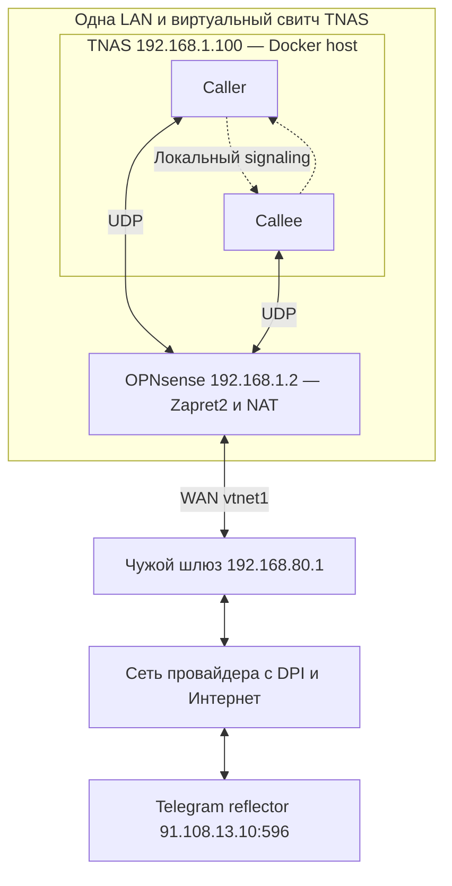

# Telegram Voice: топология лаборатории, DPI и ограниченный TTL фейков

**Дата:** 2026-10-05

**Проверено и уточнено:** 2026-10-07; документация на `49a294b38f001b6a217d406d277bb71e96107637`, закреплённые исходники CLI/Zapret2 и опубликованные отчёты A1/A2. Новых сетевых испытаний и повторного разбора исходных PCAP в этой проверке не было.

**Статус:** выводы обсуждения и проверка исходников; новых сетевых испытаний не было. Гипотеза ограниченного TTL ещё не проверена.

**Исходное состояние проекта:** `ab4bff1679aeacaa2af1058852e0ae6934a3ab7a`, пакет `0.5.0_3`.

**Текущий следующий шаг:** [START_HERE](../START_HERE.md); подробный порядок выполнения принадлежит [плану Docker-экспериментов](../architecture/TELEGRAM_VOICE_DOCKER_STRATEGY_CAMPAIGN.md#next-experiment-limited-fake-ttl-planned-not-run).

## Цель и границы обсуждения

Приоритет владельца — добиться воспроизводимого установления реальных Telegram-звонков через OPNsense `192.168.1.2`; к исследованию качества звука переходить после установления соединения. Сохраняется выбранный порядок: сначала отбор стратегии на существующей Docker-лаборатории, затем повторяемый лабораторный успех, затем проверка реального удалённого звонка. Человек не должен звонить для проверки каждого кандидата.

Рабочий Telegram TCP/TLS идёт через существующие PF/Squid и sing-box→Squid к настроенному в GUI родительскому HTTP-прокси `185.203.117.88:33128`. Этот путь сохраняется. Telegram UDP проходит через выбранную обработку Zapret2 и тот же WAN/провайдера. HTTP-прокси не является UDP-выходом. Цель постоянного разделения LAN, собственных приложений OPNsense и SOCKS5-клиентов остаётся в [контракте лаборатории](../architecture/TELEGRAM_TRAFFIC_POLICY.md), а будущий продуктовый объём плагина — только UDP.

Владелец указывает DPI провайдера после чужого шлюза `192.168.80.1`; доступа к этому шлюзу нет. Это исходная предпосылка исследования, а не положение устройства, измеренное нашими PCAP. Старый TGVOICE-маршрут через `192.168.1.140` выведен из использования. Новый VPN, другой провайдер или перенос голосового трафика на другой выход не являются текущим планом.

## Где находится внешний участок при общей LAN

Владелец подтвердил: TNAS и OPNsense находятся в одной сети `192.168.1.0/24` и одном виртуальном свитче TNAS. Локален участок между TNAS и LAN-интерфейсом OPNsense. В режиме `reflector` сервером назначения остаётся внешний Telegram-рефлектор `91.108.13.10:596`.

Стрелки в обе стороны показывают предполагаемый путь успешного обмена, а не уже полученные ответы: в измеренных A1/A2 входящих пакетов рефлектора не было.

Для исходящего пакета TNAS: IP-источник `192.168.1.100`, IP-назначение `91.108.13.10`, UDP-порт назначения `596`, следующий шлюз `192.168.1.2`. Ethernet-кадр доставляется MAC-адресу OPNsense, но IP-назначение не заменяется адресом шлюза. Затем пакет выходит через OPNsense WAN `192.168.80.251` и чужой upstream. При работающем обмене рефлектор пересылает данные между двумя клиентскими потоками, и ответы возвращаются через WAN/NAT к соответствующему сокету TNAS.

В контейнере находятся **два клиента**, а не локальный сервер, принимающий изменённый трафик сразу после Zapret2. В [исходнике CLI](https://github.com/TelegramMessenger/tgcalls/blob/efd330ca04f74706024a5abdfb5b41f4e4dd1065/tools/cli/main.cpp) `SignalingBridge` передаёт управляющие сообщения между экземплярами внутри процесса; при `--mode reflector` у обоих `enableP2P=false`, указан внешний сервер с `isTcp=false`. Поэтому при зафиксированном маршруте этот режим предназначен для внешнего UDP-обмена, без TCP-прокси fallback. Реальное движение пакетов всё равно подтверждается синхронными LAN/WAN-захватами.

Общая LAN не обесценивает reflector-тест. Локальная проверка `--mode p2p` имеет другой смысл: она квалифицирует сборку и исполнение бинарника. Она не проверяет DPI провайдера. Переносить весь контейнер за DPI или эмулировать DPI для проверки существующего внешнего пути не требуется.

## Что в представлении о фейках и TTL верно

Ограниченный TTL — один из способов сделать так, чтобы DPI увидел дополнительный пакет, а конечный сервер его не получил. Это не универсальное описание всех стратегий Zapret2.

| Механизм | Что происходит с фейком или оригиналом |
|---|---|
| Отдельный фейк с ограниченным IPv4 TTL | Должен дойти до точки анализа DPI и истечь до сервера. При исчерпании TTL уничтожается весь пакет. Настоящий пакет сохраняет достаточный TTL. |
| Фейк с неверной ненулевой UDP-контрольной суммой | При достижении получателя должен быть отвергнут проверкой UDP checksum. Такой пакет может быть отфильтрован раньше или проигнорирован самим DPI. |
| Фейк с корректной checksum, но неподходящим содержимым | Может дойти до сервера; дальнейшая реакция зависит от протокола и реализации. Нельзя без измерения утверждать, что он безвреден или стал причиной отказа. |
| Фрагментация настоящего IP-пакета | Получатель собирает фрагменты в исходную датаграмму. Это не исчезновение фейков по TTL. В `send:ipfrag` плюс `drop` оригинал заменяется фрагментами. |

TTL на маршрутизаторах **уменьшается**, а не увеличивается. Он не «снимает изменения» с настоящего пакета. В общем случае исходная полезная нагрузка сохраняется отдельно от дополнительных фейков либо восстанавливается при сборке фрагментов. Это следует из [RFC 1812, §5.3.1](https://www.rfc-editor.org/rfc/rfc1812.html#section-5.3.1) и [RFC 1122, §3.3.2 и §4.1.3.4](https://www.rfc-editor.org/rfc/rfc1122.html).

По [документации Zapret2 v1.0.5.2](https://github.com/bol-van/zapret2/blob/v1.0.5.2/docs/manual.en.md#fake), `fake()` отправляет отдельный пакет или группу пакетов и сам по себе не блокирует оригинал. Параметр [`ip_ttl`](https://github.com/bol-van/zapret2/blob/v1.0.5.2/docs/manual.en.md#standard-fooling) задаётся явно. Само наличие `fake` или `badsum` не означает короткий TTL. UDP-фейки имеют смысл против некоторых способов ведения состояния DPI; гарантии обхода статического блока по адресу или любого DPI нет.

## Что уже показали A1/A2

Ниже пересказ опубликованных измерений [A1](../verification/evidence/2026-10-03-docker-a1-wire-pass-no-reflector-reply.md) и [A2](../verification/evidence/2026-10-03-docker-a2-valid-checksum-fakes-no-reflector-reply.md). В обсуждении 5 октября исходные архивы заново не разбирались и новый звонок не запускался.

| Свойство | A1 | A2 |
|---|---|---|
| Настоящие WAN Hello | 60, полезная нагрузка сохранена | 60, полезная нагрузка сохранена |
| Дополнительные WAN-фейки | 120 × zero16 | 120 × zero16 |
| UDP checksum фейков | Намеренно неверная | Корректная |
| Порядок | Два фейка перед каждым оригиналом | Два фейка перед каждым оригиналом |
| Ответы рефлектора | 0 | 0 |
| Клиенты / результат | Оба Reconnecting, BWE=0, exit=1 | Оба Reconnecting, BWE=0, exit=1 |

В A2 **у всех 180 WAN-пакетов TTL=63**, включая фейки; у настоящих LAN-пакетов TTL=64. Следовательно, A2 не испытывал специально ограниченный TTL фейков. Он не доказывает ни доставку фейков до сервера, ни их истечение за DPI. Результат обоих опытов — `WIRE_OK / NO_REPLY_UNKNOWN`, без `MEDIA_PASS`.

Захват на WAN доказывает локальную отправку. Без ответа и без наблюдения на удалённой стороне он не определяет точное место потери: до/в/после DPI, на обратном пути или на сервере. Принятая предпосылка о блокировке провайдером сохраняется, но отдельному пакету нельзя приписать неизмеренную судьбу.

Уже завершённые baseline, ordered8, reverse8/16/24/32, fakefrag8+reverse24 и варианты original/tee сохраняют свой диагностический смысл и документированные ограничения. Повторять перебор позиций фрагментации без нового основания не предлагается. Ранее сообщённый владельцем успешный звонок через `.1.2` также сохраняется как наблюдение; его точная выигравшая конфигурация пока не восстановлена.

## Границы достоверности лабораторного успеха

Проверка [текущего CLI](https://github.com/TelegramMessenger/tgcalls/blob/efd330ca04f74706024a5abdfb5b41f4e4dd1065/tools/cli/main.cpp) выявляет более слабый критерий самого процесса, чем требуется проекту: общий `establishedAt` выставляется при `Established` **любого** участника. Код 0 дополнительно требует статистику и ненулевой BWE обоих, но сам по себе не проверяет устойчивое состояние `Established` обоих участников. Показатель BWE — оценка пропускной способности, а не проверка слышимого звука.

Поэтому сохраняется строгий проектный критерий: оба участника установили соединение, есть статистика/BWE обоих, exit=0 и коррелированный двусторонний UDP через внешний рефлектор. Отдельно нужны повторяемость и последующий реальный звонок. `NoOpRenderer` не проверяет услышанную речь. Успешная упаковка архива или код 0 скрипта сбора данных также не являются `MEDIA_PASS`.

CLI передаёт signaling внутри процесса. Поэтому неисправность внешнего Telegram TCP-прокси сама по себе не делает все старые reflector-испытания недействительными. Для реального приложения рабочий TCP/signaling остаётся необходимой отдельной частью схемы.

Дополнительная граница сравнения с реальным клиентом: исходный приватный `log.txt` (SHA-256 `1b53cd0ee9155b36b79fe91f78191d0335dc0834f5918d9c146219de5dfebb80`) соответствует попытке 2 октября 16:16–16:17 МСК и указывает engine `8.0.0`, P2P OFF. Это другая копия, чем более поздний startup-log в [ранее опубликованном отчёте](../verification/evidence/2026-10-02-telegram-desktop-webrtc-ice-timeout-on-opnsense-gateway.md); прежний отчёт о несовпадающих копиях не объявляется ошибочным. Совпадающий `last_call_log.txt` имеет SHA-256 `65f1b29be4819ee26a873a015eba6b8b90249f9165d7cfe726001e4d2bc9b4d5`. Он показывает обмен signaling и отсутствие установленного ICE/media-пути до таймаута; ошибки вспомогательных TnasOnline/iSCSI-интерфейсов не обосновывают отключение рабочих интерфейсов.

У Telegram Desktop [v7.2.9 gitlink tgcalls](https://github.com/telegramdesktop/tdesktop/tree/v7.2.9/Telegram/ThirdParty/tgcalls) — `2faee3b5524f54d56c91c2058c00e11c656a74b3`. Сравнение `SendReflectorHello()` в [этом исходнике](https://github.com/TelegramMessenger/tgcalls/blob/2faee3b5524f54d56c91c2058c00e11c656a74b3/tgcalls/v2/ReflectorPort.cpp) и [лабораторном pin](https://github.com/TelegramMessenger/tgcalls/blob/efd330ca04f74706024a5abdfb5b41f4e4dd1065/tgcalls/v2/ReflectorPort.cpp) показало одинаковую функцию. Различие engine 8/13 не является установленным объяснением отсутствия первого ответа на Hello; полная эквивалентность последующих стадий реального клиента лаборатории этим не доказана. Версию движка не менять одновременно с TTL.

## Обоснование следующей гипотезы

**Гипотеза:** при остальных параметрах A2 без изменений фейки с корректной UDP checksum и ограниченным TTL могут повлиять на классификацию DPI, не достигая рефлектора; настоящие Hello сохраняют нормальный TTL. Это непроверенная возможность, а не найденная рабочая настройка и не доказательство, что прежние фейки мешали серверу.

Для её действия должен существовать диапазон TTL, при котором фейк достигает точки анализа и истекает до назначения. Расположение DPI и такой диапазон сейчас не измерены. Обычная трассировка показывает отвечающие маршрутизаторы, но не обязана показывать DPI; устройства могут не отвечать, а пути могут меняться. Доступ к настройкам чужого `.80.1` не нужен для отправки этих проб и наблюдения ответов.

[`ip_autottl`](https://github.com/bol-van/zapret2/blob/v1.0.5.2/docs/manual.en.md#autottl) опирается на TTL входящего пакета и предположения о начальном TTL и симметрии маршрута. При отсутствии ответов нельзя выдавать его за измеренную автоматическую настройку: без данных он использует явный `ip_ttl`, если задан, иначе TTL остаётся прежним. Для следующего опыта нужны явно записанное значение и проверка фактического WAN TTL отдельно у фейков и оригиналов.

Для сокращения числа опытов сохраняются один endpoint, бинарник/engine, payload, число повторов, helper, NAT/PFIL и маршрут. После сведений о пути выбирается ограниченный список TTL и заранее записывается предел серии. Нет оснований считать успех монотонным по TTL и применять двоичный поиск. После первого принятого библиотекой ответа дальнейший перебор уступает проверке обоих участников и воспроизводимости. Неуспех одного TTL или ограниченного набора относится только к этим значениям, endpoint и времени; он не опровергает все способы обхода.

Сейчас [v4 runner](../../tools/telegram-voice-lab/run-a1-opnsense.sh) сохраняет stdout/stderr CLI, но не передаёт `--log-file`; WAN-фильтр `host 91.108.13.10 and ip` может не захватить ICMP Time Exceeded от промежуточного маршрутизатора. В ближайшем изменении runner следует включить полный RTC-лог и ограниченный сбор ICMP ошибок с корреляцией процитированного внутреннего пакета. Даже полученный ICMP не доказывает положение DPI. Полный порядок, остановки и восстановление — в [плане ближайшего эксперимента](../architecture/TELEGRAM_VOICE_DOCKER_STRATEGY_CAMPAIGN.md#next-experiment-limited-fake-ttl-planned-not-run).

Эта запись меняет только документацию. Новый runner, числовые TTL, изменения GUI и сетевые испытания по данной гипотезе ещё не выполнены; рабочий TCP, package identity и текущая конфигурация устройств этой записью не изменяются.

## Проверка документации 7 октября

Основные выводы о внешнем reflector-пути, уменьшении TTL, независимых фейках, результате A1/A2 и ограничениях CLI подтверждены указанными выше исходниками и опубликованными измерениями. Ранее сообщённый успех через `.1.2` сохранён; воспроизводимая выигравшая настройка по-прежнему не установлена.

При проверке обнаружены и исправлены следующие неточности в связанных активных документах:

| Неточность | Исправление |
|---|---|
| В финальной проверке реального звонка оставалось требование выключать/включать весь Voice-helper | При сравнении выбранной fake-стратегии меняется только экспериментальное действие; helper и перехват UDP остаются включены. Иначе одновременно меняются стратегия и доставка пакетов в dvtws2. |
| Общее определение `WIRE_OK` требовало правильные checksum у всех пакетов | Настоящие датаграммы должны быть корректны, а checksum фейков — соответствовать выбранной стратегии. Намеренный `badsum` в A1 совместим с его `WIRE_OK`. Подавление оригинала проверяется только у стратегий, которые его требуют. |
| Звук без захваченного двустороннего UDP назывался доказательством fallback | Это наблюдение звука с неустановленным транспортом: TCP fallback или другой путь возможны, но не доказаны таким захватом. |
| План называл повторяемость и ограниченную серию без конкретного рабочего бюджета и развилок | В [кампании](../architecture/TELEGRAM_VOICE_DOCKER_STRATEGY_CAMPAIGN.md#next-experiment-limited-fake-ttl-planned-not-run) теперь заданы ожидаемые результаты каждого шага, не более четырёх разных TTL в первой серии, остановка на полезном ответе, три успешных свежих запуска для первичного подтверждения и действия при отрицательном результате. |

Проверка исходника существующего v4 runner дополнительно ограничивает прежнее слово «qualified»: его A1/A2 сбор данных подтверждён, но это не готовность к TTL-эксперименту. Он не собирает RTC через `--log-file`; диагностика сохранённой GUI-строки сама по себе не блокирует запуск при уже подходящем effective-профиле; наличие ожидаемого действия не исключает все дополнительные действия в блоке. В ближайшем изменении нужны явные проверки **обоих** полных профилей и управляемого завершения удалённого процесса. Эти пункты пока являются задачами, а не исправленным кодом или причиной прошлых сетевых неуспехов.

Ограниченный TTL остаётся проверяемой гипотезой, а не обещанием звонка. Цель ближайшего исполнения — получить данные, которые разделяют отсутствие внешнего ответа, локальную потерю входящего ответа и отказ следующей стадии ICE/media. Конкретные значения TTL выбираются и записываются до запуска; этой проверкой они не назначены.
